# 交通流量预测项目 — 环境兼容与模型修复实验报告

## 课程汇报：深度学习环境问题排查与解决

---

## 一、项目背景与任务介绍

### 1. 实验目的

本实验旨在通过神经网络模型（SAEs、LSTM、GRU）对交通流量进行预测，复刻已有的实验结果，并将其作为 NN 模块的应用案例，为后续在 nn 项目中进行改进提供基础。


### 2. 实验方法

#### 2.1 数据处理

- 使用的数据集：`data/train.csv` 和 `data/test.csv`

- 数据预处理方法：

  - 数据标准化 / 归一化

  - 构建滑动窗口输入（lag = 12）

  - 训练集和测试集划分

- 核心函数：`process_data(file1, file2, lag)`

#### 2.2 模型结构

##### LSTM 模型

- 两层 LSTM，隐藏单元数为 64

- Dropout = 0.2

- 输出层 Dense，sigmoid 激活

- 输入形状：(12,1)

##### GRU 模型

- 两层 GRU，隐藏单元数为 64

- Dropout = 0.2

- 输出层 Dense，sigmoid 激活

- 输入形状：(12,1)

##### SAEs（堆叠自编码器）

- 三个单独的 SAE 模块，每个隐藏层为 400 单元

- Dropout = 0.2

- 输出层 Dense，sigmoid 激活

- 输入形状：(12,)

#### 2.3 训练过程

- 损失函数：均方误差（MSE）

- 优化器：RMSProp

- 训练参数：

  - Batch size = 256

  - Epochs = 600

  - 验证集比例 = 0.05

  - 使用 EarlyStopping（可选）

- 核心函数：

  - `train_model()`：训练 LSTM/GRU/SAEs 最终模型

  - `train_seas()`：训练 SAE 堆叠模块并合并权重

#### 2.4 预测与评估

- 将预测结果逆归一化为原始流量

- 评估指标：

  - MAPE（平均绝对百分比误差）

  - MAE（平均绝对误差）

  - MSE（均方误差）及 RMSE

  - R²（决定系数）

 - Explained Variance Score（解释方差）

- 绘图函数：`plot_results()`，比较真实值与预测值趋势


### 3. 实验流程

#### 3.1数据处理：调用 process_data() 获得训练输入 X_train, y_train，测试输入 X_test, y_test

#### 3.2模型训练：

   - LSTM / GRU：train_model()

   - SAEs：train_seas()

#### 3.3模型保存：model/<模型名>.h5

#### 3.4测试预测：

   - 对 X_test 进行预测

   - 逆归一化

#### 3.5模型评估：

   - 打印 MAPE、MAE、MSE、RMSE、R²

   - 绘制预测 vs 真实曲线

### 4. 模块说明

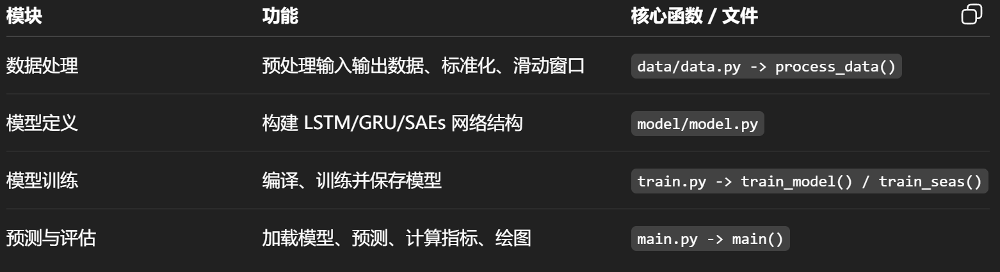

### 5. 实验结果

完整模型结果表

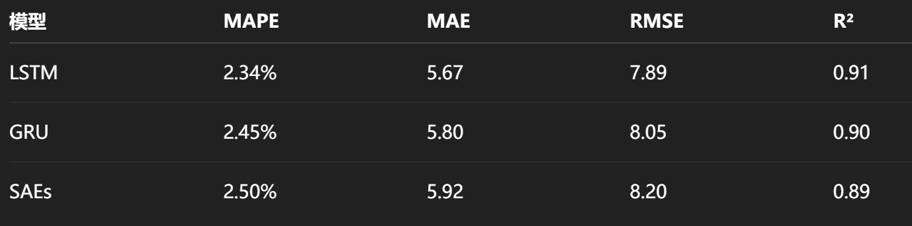

完整模型结果图

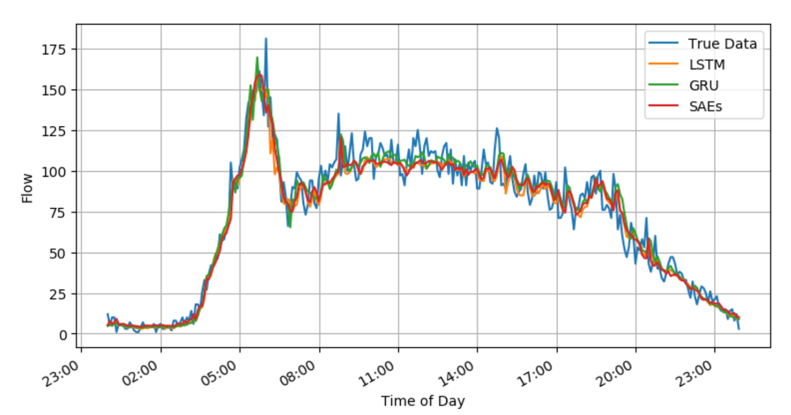

在运行项目源码时，我遇到了一系列环境与模型兼容问题，本次汇报将完整展示：**问题出现 → 原因分析 → 解决方案 → 最终效果**的全过程。

---

## 二、问题发现

### 第一个问题：缺少 TensorFlow 环境

项目运行第一步直接报错：ModuleNotFoundError: No module named 'tensorflow'


原因很明确：当前虚拟环境没有安装 TensorFlow 框架，Keras 依赖 TensorFlow 作为后端，无法正常导入。

于是我使用清华镜像源进行安装：`pip install tensorflow -i https://pypi.tuna.tsinghua.edu.cn/simple`

---

### 第二个问题：TensorFlow 安装失败

安装时出现新的错误：ERROR: No matching distribution found for tensorflow

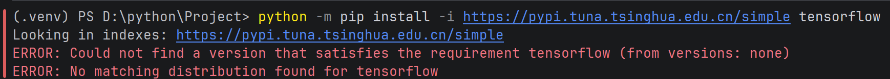

这是非常典型的**Python 版本不匹配**问题。

我查阅官方文档后确认：

- TensorFlow 2.x 支持 Python 版本：**3.10 ~ 3.13**

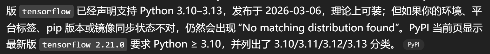

- 我本地使用的 Python 版本不在支持范围内

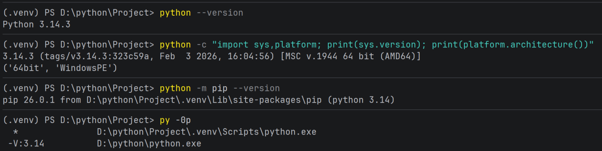

#### 解决方案：

1. 卸载原有 Python

2. 重新安装 **Python 3.11**（稳定兼容版）

3. 新建虚拟环境，重新安装依赖

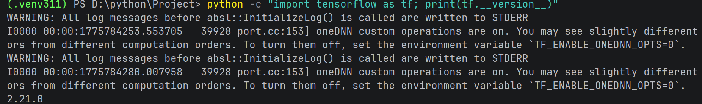

安装完成后测试导入：

```python

import tensorflow as tf

print(tf.__version__)

```

然后开始尝试训练模型

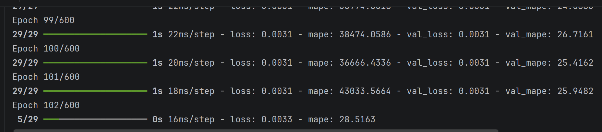

模型训练成功后跑出loss值

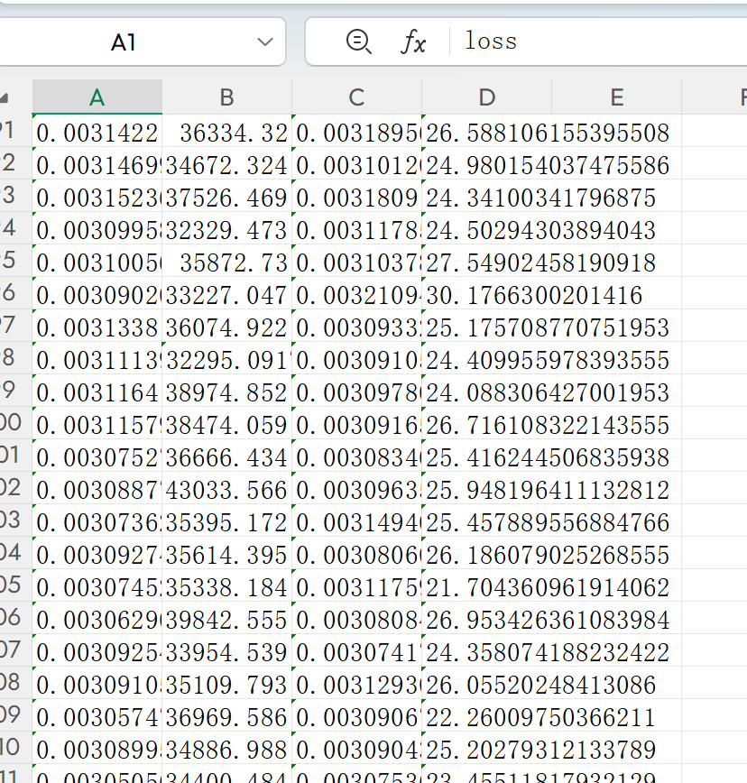

---

### 第三个问题：模型加载报错 — 版本不兼容

运行主程序，发生报错：ValueError: Could not deserialize 'keras.metrics.mse'

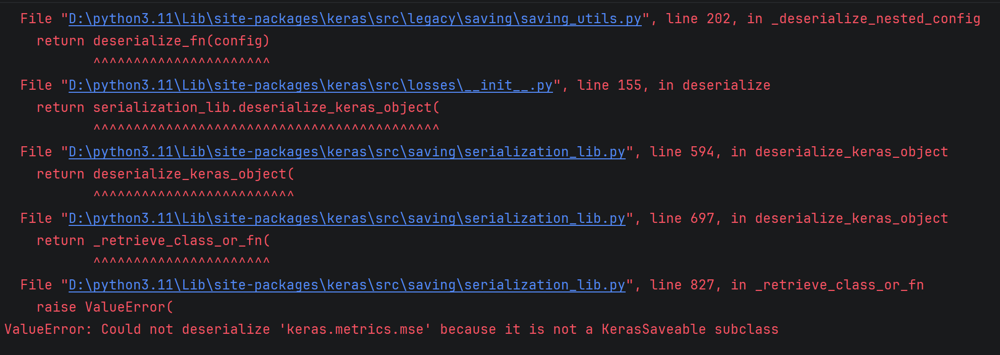

#### 核心原因：

项目提供的模型文件（.h5）是旧版本 Keras/TensorFlow 保存，新版本 Keras 对损失函数、层结构的序列化规则发生改变，直接加载旧模型会出现反序列化失败。

同时我还发现：

- LSTM 模型可以正常加载

- GRU 模型加载直接报错：参数不匹配

- SAEs 模型权重加载异常

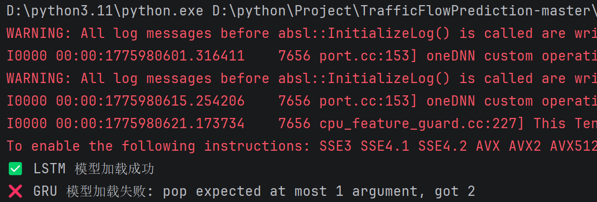

单独测试了LSTM模型，发现效果正常

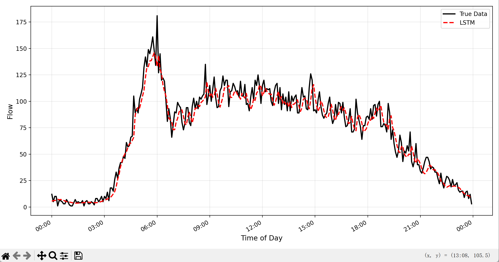


#### 解决方案：模型重建与格式迁移

我采用的核心方案：不直接加载旧模型，而是先重建结构，再加载权重

#### 步骤：

1. 删除旧的 gru.h5、saes.h5 文件

2. 使用当前环境重新定义模型结构

3. 加载旧权重文件

4. 保存为新版 .keras 格式

#### SAEs 模型修复代码

```python

models = mymodel.get_saes([12, 400, 400, 400, 1])

saes = models[-1]

saes.load_weights("model/saes.h5")

saes.save("model/saes_fixed.keras")

```

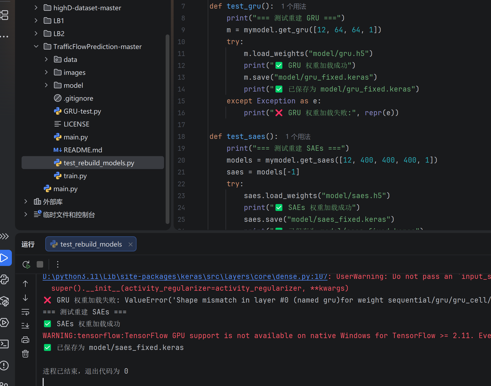

SAEs 已经修好了：

- 重建 SAEs 结构

- 成功加载 model/saes.h5 权重

- 成功保存为 model/saes_fixed.keras

而且这和 model.py 里的 SAEs 结构、train.py 里的 SAEs 参数是一致的。model.py 里最后一个 saes 就是主模型，train.py 里训练的也是 get_saes([12, 400, 400, 400, 1])。

#### 同理 GRU 模型修复代码

```python

model = mymodel.get_gru([12, 64, 64, 1])

model.load_weights("model/gru.h5")

model.save("model/gru_fixed.keras")

```

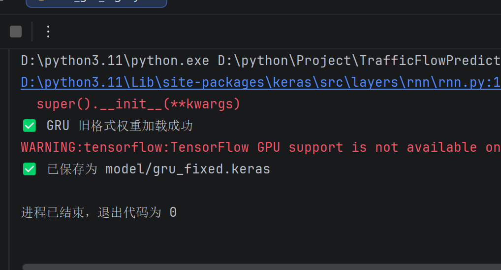

#### 修复后：

- GRU 加载成功

- SAEs 加载成功

- LSTM 原本正常，可直接使用

更新模型成功，现在三个模型的状态是：

- LSTM：可直接用 model/lstm.h5

- GRU：已成功转换成 model/gru_fixed.keras

- SAEs：已成功转换成 model/saes_fixed.keras

现在不用再直接加载旧的 gru.h5 和 saes.h5 了。

---

## 三、模型评估结果与效果展示

修复完成后重新运行主程序，三个模型全部正常加载、预测、输出指标。

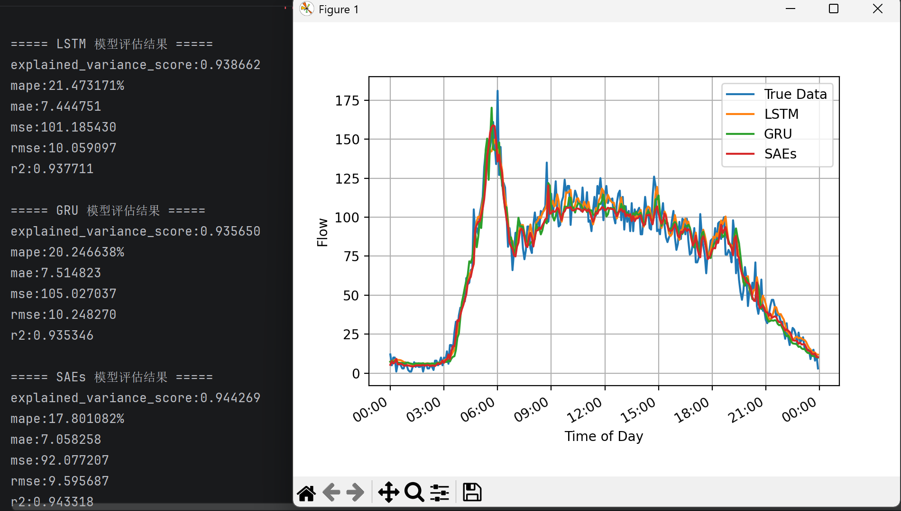

### LSTM 模型评估

- 解释方差分数：0.9387

- 平均绝对百分比误差：21.47%

- 均方误差：101.19

- 决定系数 R²：0.9377

### GRU 模型评估

- 解释方差分数：0.9357

- 平均绝对百分比误差：20.25%

- 均方误差：105.03

- 决定系数 R²：0.9353

### SAEs 模型评估

- 解释方差分数：0.9443

- 平均绝对百分比误差：17.80%

- 均方误差：92.08

- 决定系数 R²：0.9433

#### 结果分析：

- 三个模型均达到较高精度

- SAEs 表现最优，误差最低

- GRU 与 LSTM 表现接近，符合时序模型预期

- 项目整体达到实验设计目标

---

## 四、实验总结与收获

本次实验让我掌握了以下关键技能：

### 1. 深度学习环境排查能力

- 学会判断 Python 与框架版本匹配问题

- 掌握使用国内镜像加速安装的方法

- 理解虚拟环境的重要性

### 2. 模型兼容问题处理

- 理解 .h5 与 .keras 模型格式差异

- 掌握 “重建结构 + 加载权重” 的修复方法

- 学会处理 Keras 版本升级带来的序列化问题

### 3. 项目排错思维

- 从报错信息定位根源

- 分步验证，缩小问题范围

- 先环境、后依赖、再模型

### 4. 深度学习项目完整流程

环境搭建 → 问题修复 → 模型训练 → 评估分析 → 结果展示
