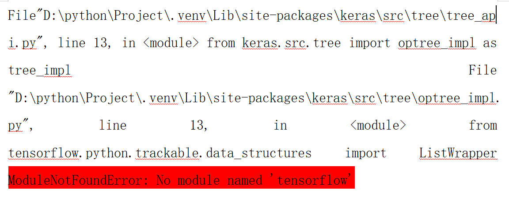

# 交通流量预测项目 — 环境兼容与模型修复实验报告
## 课程汇报：深度学习环境问题排查与解决

---

# 一、项目背景与任务介绍
本次实验基于交通流量预测任务，使用深度学习模型对时序交通数据进行建模与预测。
项目主要使用三种模型：
- LSTM（长短期记忆网络）
- GRU（门控循环单元）
- SAEs（堆叠自编码器）

项目目标：
1. 搭建深度学习环境
2. 完成模型训练与加载
3. 实现交通流量预测
4. 输出模型评估指标并可视化

在运行项目源码时，我遇到了一系列环境与模型兼容问题，
本次汇报将完整展示：**问题出现 → 原因分析 → 解决方案 → 最终效果**的全过程。

---

# 二、第一个问题：缺少 TensorFlow 环境
项目运行第一步直接报错：ModuleNotFoundError: No module named 'tensorflow'




原因很明确：当前虚拟环境没有安装 TensorFlow 框架，
Keras 依赖 TensorFlow 作为后端，无法正常导入。

于是我使用清华镜像源进行安装：pip install tensorflow -i https://pypi.tuna.tsinghua.edu.cn/simple

---

# 三、第二个问题：TensorFlow 安装失败
安装时出现新的错误：ERROR: No matching distribution found for tensorflow


这是非常典型的**Python 版本不匹配**问题。
我查阅官方文档后确认：
- TensorFlow 2.x 支持 Python 版本：**3.10 ~ 3.13**

- 我本地使用的 Python 版本不在支持范围内


解决方案：
1. 卸载原有 Python
2. 重新安装 **Python 3.11**（稳定兼容版）
3. 新建虚拟环境，重新安装依赖


安装完成后测试导入：
```python
import tensorflow as tf
print(tf.__version__)

然后开始尝试训练模型


模型训练成功后跑出loss值


---

# 四、第三个问题：模型加载报错 — 版本不兼容
运行主程序，发生报错：ValueError: Could not deserialize 'keras.metrics.mse'


核心原因：
项目提供的模型文件（.h5）是旧版本 Keras/TensorFlow 保存
新版本 Keras 对损失函数、层结构的序列化规则发生改变
直接加载旧模型会出现反序列化失败
同时我还发现：
LSTM 模型可以正常加载
GRU 模型加载直接报错：参数不匹配
SAEs 模型权重加载异常

单独测试了LSTM模型，发现效果正常


---

#五、解决方案：模型重建与格式迁移
我采用的核心方案：不直接加载旧模型，而是先重建结构，再加载权重
步骤：
删除旧的 gru.h5、saes.h5 文件
使用当前环境重新定义模型结构
加载旧权重文件
保存为新版 .keras 格式

SAEs 模型修复代码
models = mymodel.get_saes([12, 400, 400, 400, 1])
saes = models[-1]
saes.load_weights("model/saes.h5")
saes.save("model/saes_fixed.keras")

SAEs 已经修好了
重建 SAEs 结构 
成功加载 model/saes.h5 权重 
成功保存为 model/saes_fixed.keras 
而且这和 model.py 里的 SAEs 结构、train.py 里的 SAEs 参数是一致的。model.py 里最后一个 saes 就是主模型，train.py 里训练的也是 get_saes([12, 400, 400, 400, 1])。

同理GRU 模型修复代码
model = mymodel.get_gru([12, 64, 64, 1])
model.load_weights("model/gru.h5")
model.save("model/gru_fixed.keras")


修复后：
GRU 加载成功
SAEs 加载成功
LSTM 原本正常，可直接使用

更新模型成功，现在三个模型的状态是：
LSTM：可直接用 model/lstm.h5 
GRU：已成功转换成 model/gru_fixed.keras 
SAEs：已成功转换成 model/saes_fixed.keras 
现在不用再直接加载旧的 gru.h5 和 saes.h5 了。

---

# 六、模型评估结果与效果展示
修复完成后重新运行主程序，
三个模型全部正常加载、预测、输出指标。


LSTM 模型评估
解释方差分数：0.9387
平均绝对百分比误差：21.47%
均方误差：101.19
决定系数 R²：0.9377
GRU 模型评估
解释方差分数：0.9357
平均绝对百分比误差：20.25%
均方误差：105.03
决定系数 R²：0.9353
SAEs 模型评估
解释方差分数：0.9443
平均绝对百分比误差：17.80%
均方误差：92.08
决定系数 R²：0.9433
从结果可以看出：
三个模型均达到较高精度
SAEs 表现最优，误差最低
GRU 与 LSTM 表现接近，符合时序模型预期
项目整体达到实验设计目标

---

#七、实验总结与收获
本次实验让我掌握了以下关键技能：
深度学习环境排查能力
学会判断 Python 与框架版本匹配问题
掌握使用国内镜像加速安装的方法
理解虚拟环境的重要性
模型兼容问题处理
理解 .h5 与 .keras 模型格式差异
掌握 “重建结构 + 加载权重” 的修复方法
学会处理 Keras 版本升级带来的序列化问题
项目排错思维
从报错信息定位根源
分步验证，缩小问题范围
先环境、后依赖、再模型
深度学习项目完整流程
环境搭建 → 问题修复 → 模型训练 → 评估分析 → 结果展示
